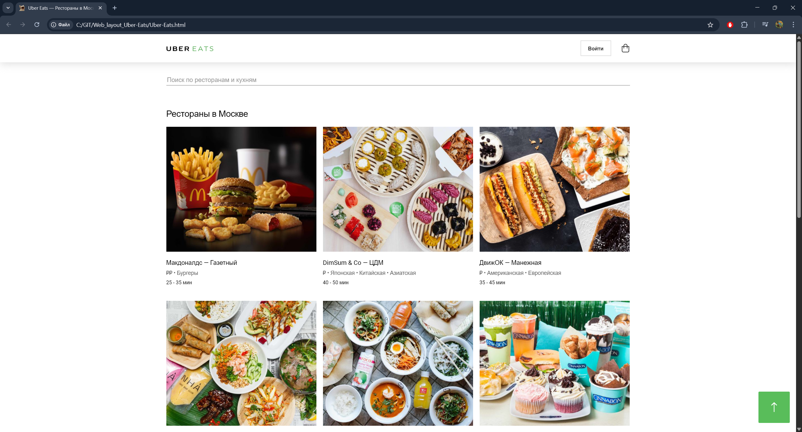
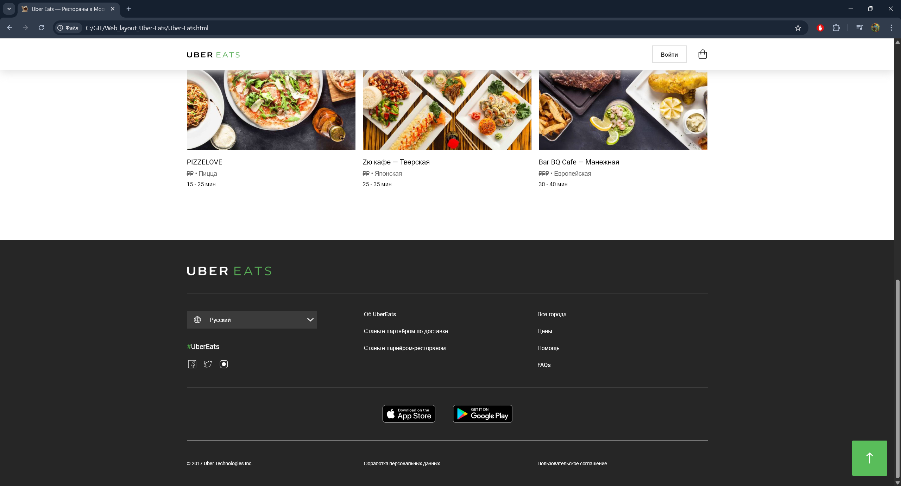
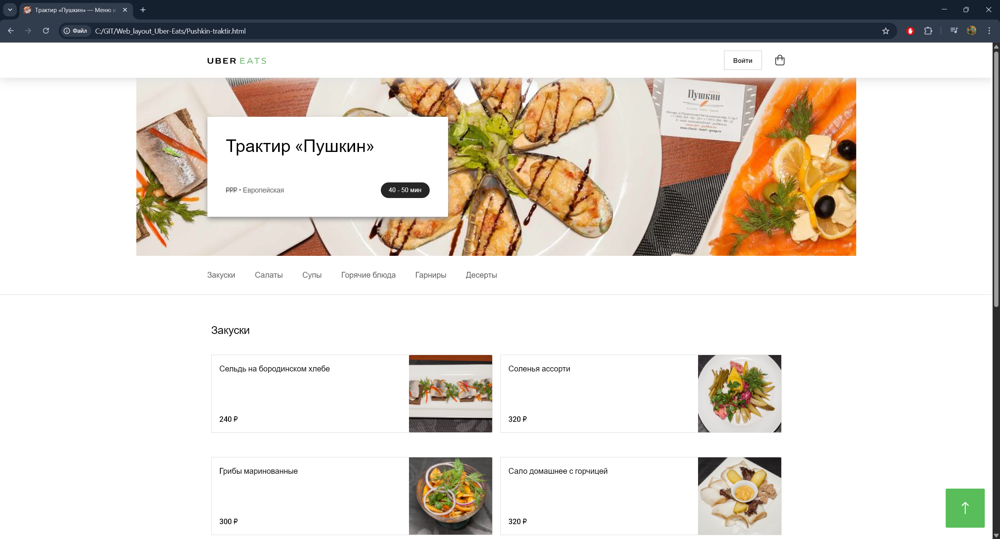
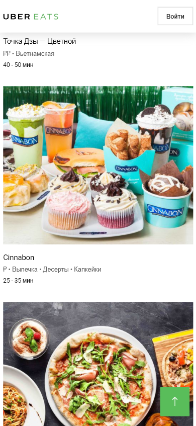
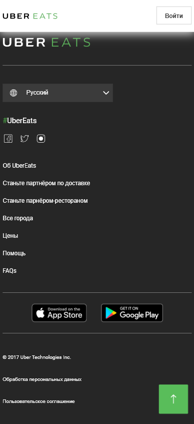
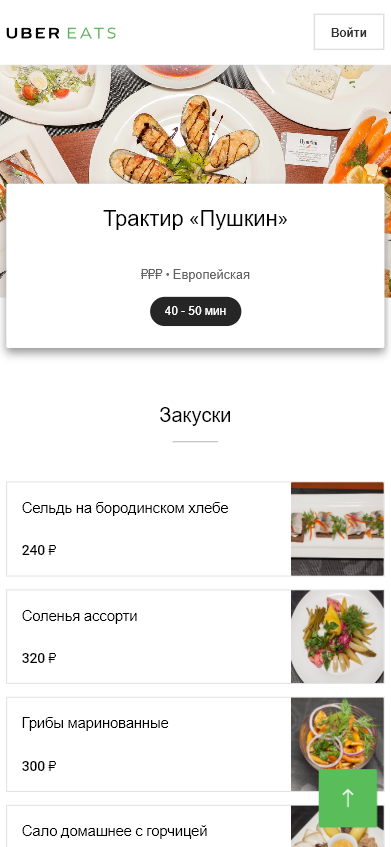
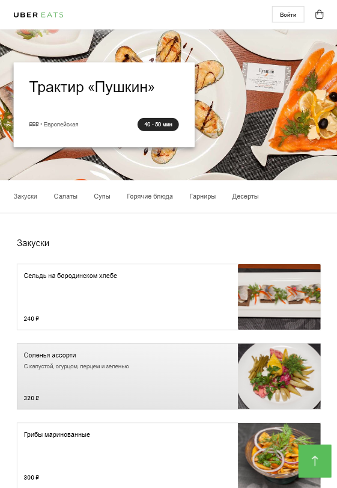
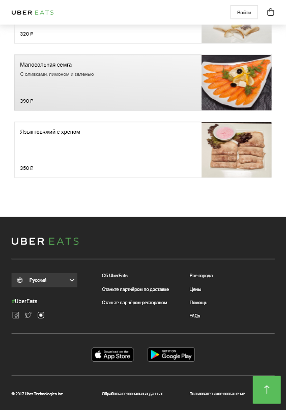
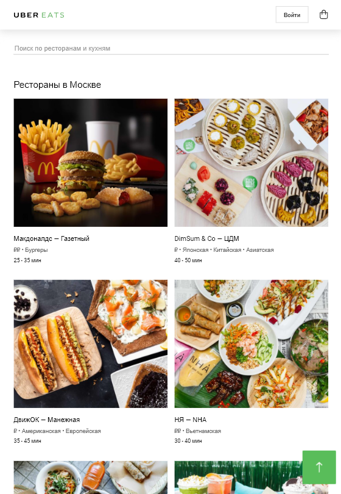

# Restaurant Delivery Landing Page (Uber Eats Concept)

Верстка многостраничного лендинга для сервиса доставки еды (концепт Uber Eats). Проект выполнен в рамках обучения и демонстрирует навыки качественной верстки, работы с сетками и адаптивности.

## Скриншоты интерфейса

### 🖥️ Десктопная версия
 
 

### 📱 Мобильная версия
|  |  |  |
|----------------------------------------------------|----------------------------------------------------|----------------------------------------------------|

### 📟 Планшетная версия
|  |  |
|----------------------------------------------------|----------------------------------------------------|
|  | &nbsp; |

## Ключевые особенности
* **Pixel Perfect**: Максимальное соответствие дизайн-макету.
* **Адаптивность**: Полная поддержка мобильных устройств, планшетов и десктопов (breakpoints: `xs`, `sm`, `md`, `lg`).
* **Интерактивность**: Реализованы выпадающие списки (дропдауны), кнопка "Вверх", ховер-эффекты для карточек и ссылок.
* **Оптимизация**: Использование SVG для иконок и логотипов, правильное подключение шрифтов.

## Стек технологий
* **HTML5**: Семантическая верстка.
* **CSS3**: Кастомные стили, работа с Flexbox, позиционирование элементов.
* **Flexbox Grid 2**: Использование современной сетки для создания гибких макетов.

## Как запустить
Просто откройте файл `Uber-Eats.html` в любом современном браузере.

---

## Контакты

Если есть вопросы или хотите сотрудничать — пишите!

AinurSirazhev@gmail.com
